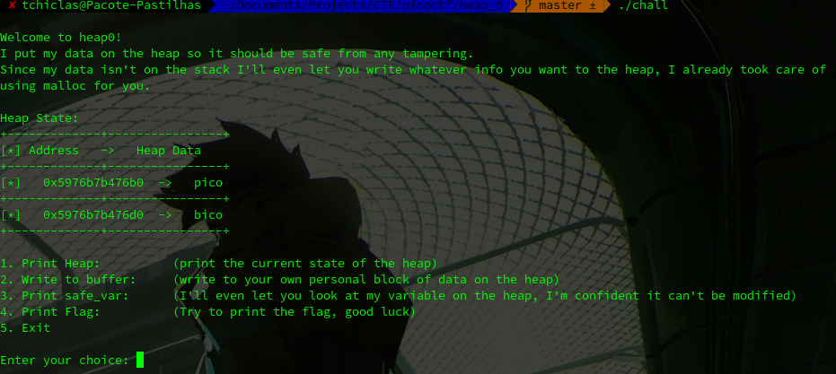
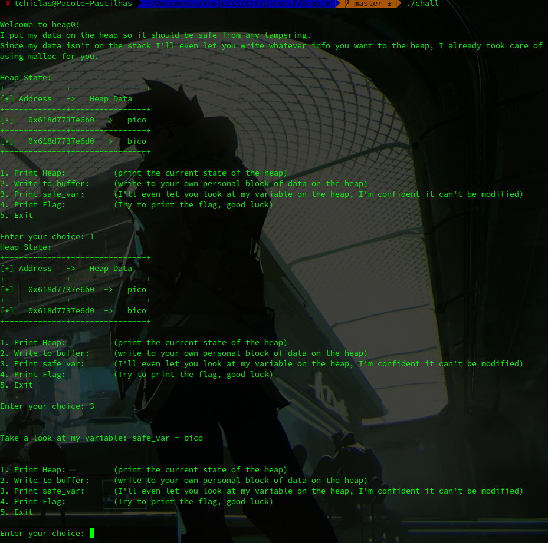
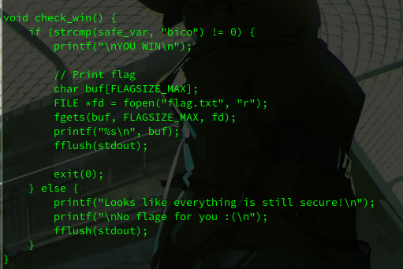
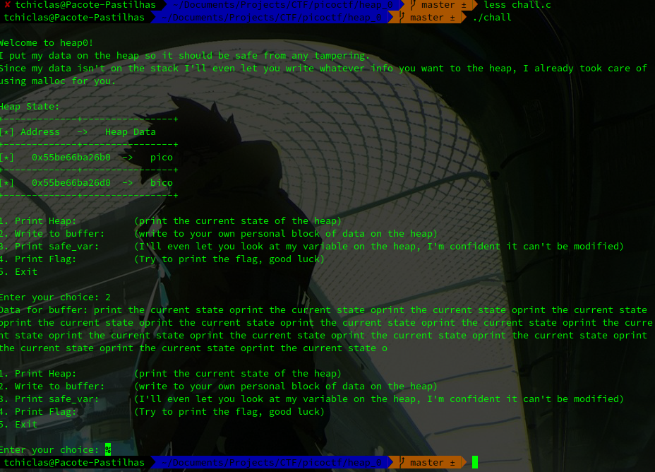
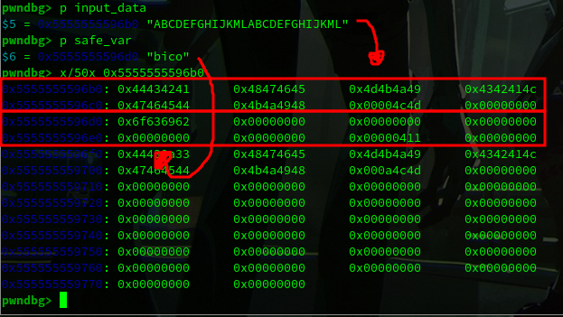
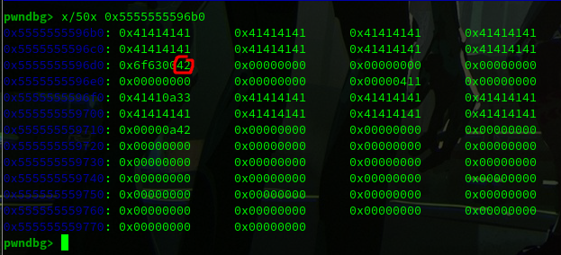
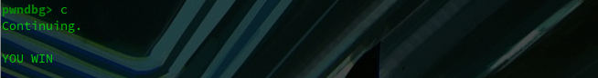

## Challenge Name: Heap 0
Category: Binary Exploitation
Points: 0
Solves: 8,906

Challenge Description: 
<descript>

Artifact Files:
* [Binary](chall)
* [Source Code](chall.c)

### Approach

As a first step, let's run the executable file to see what we are dealing with. To do so, first give it the correct permissions with:

```bash
chmod +x chall
```



From the print (and the name of the challenge) we know this is a simple heap exercise. 
The next step is to try everything we can. 



So far, we know that we need to change the variable "safe_var" from pico to something else. We also know that we are allowed to write to another variable in the heap that is actually close to what we want!



Since we are also given the source code, we can look through it. This let's us know that the "safe_var" only needs to be different than "bico", letting us be less precise with our exploit.

After analysing all of the information, we run back the executable and write to the heap, where we find no char limit! Meaning we are free to whatever we want :) But how much do we need?

#### Simple Approach

What if we try a really long input?



Oops, this let's us know it is possible to overflow! But is is not over yet, just because we broke the executable does not mean we got the flag.

We could reduce the size of the string until it isn't completly broken, which would work. However, we can also take this opportunity to learn how memory works and the debugger!

#### Thought-out approach 

Start setting up break points where we need. For example:


```
pwndbg> break write_buffer
pwndbg> break print_menu
etc...
```



Both memory addresses are pretty close to each other! We can then use `x/50x <addr>` to see the next 50 addresses.
In this case, each address will hold 4 characters! And the variable "input_data" where we write occupies 8 addresses. Therefore, to start writing outside the allocated memory we need to write 32 characters (8x4) + 1 to change the value of "safe_var".



As we can see, we filled the variable "input_data" and changed a single byte!



Done!

#### Extra Points

Now that we understand how the exploit works we can automate it! Check this simple [solution](sol.py).

### Reflections
 With this challenge we can refresh some of the basic debugger's behaviour. 

---
[Back to home](</CTF/picoctf/README.md>)
