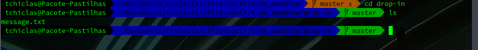

## Challenge Name: Time Machine

Category: General Skills
Points: 0
Solves: 15,468

Challenge Description: 
<descript>

Artifact Files:
* [Binary](challenge.zip)

### Approach

Let's start by inspecting the zip file we got. to unpack it run the command ´unzip challenge.zip´. From here, we see a single ´.txt´ file!.

Now, for those who do not know how git works. For this challenge we only need to know one thing:

**Git Repositories will have a history of the previously made commits!**

### Minimal Git Knowledge Approach

All meta information from git can be found in an hidden directory called *.git*

One way to see these hidden directories is to run: ´ls -a´.

Then, we can search this new discovered directory for our flag. With some looking around (or a search through multiple files), we find the flag!

### Some Git Knowledge Approach

With a quick research we can also find the command: ´git log´, which just gives us the answer! :)

### Reflections

Simple exercise, with no specific Security knowledge needed. With this challenge we learn a quick search goes a long way and sometimes the easiser solution is the right one :)

---
[Back to home](</CTF/picoctf/README.md>)
