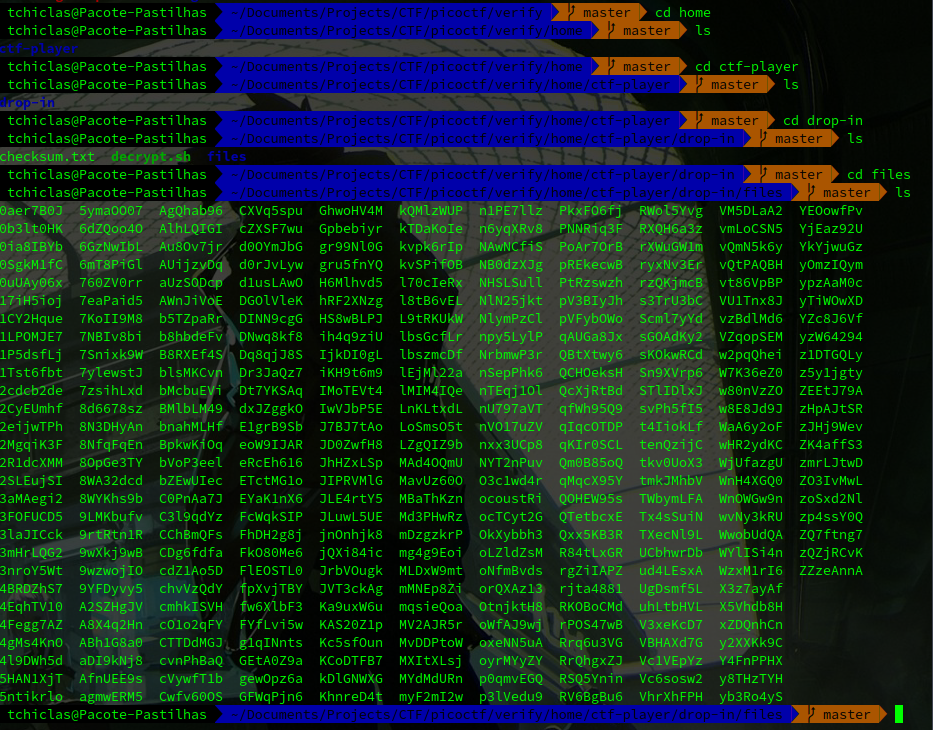

## Challenge Name: Time Machine

Category: General Skills
Points: 0
Solves: 15,468

Challenge Description: 
<descript>

Artifact Files:
* [Compressed File](challenge.zip)

### Approach

Let's start by inspecting the zip file we got. to unpack it run the command ´unzip challenge.zip´. From here, we see a single ´.txt´ file!.

This write-up already has everthing I wanted to say:
https://github.com/noamgariani11/picoCTF-2024-Writeup/blob/main/Forensics/Verify.md

---
[Back to home](</CTF/picoctf/README.md>)
